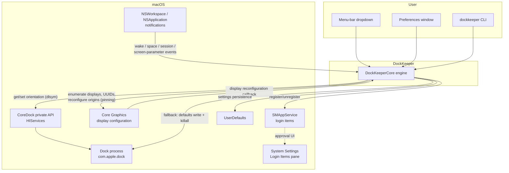
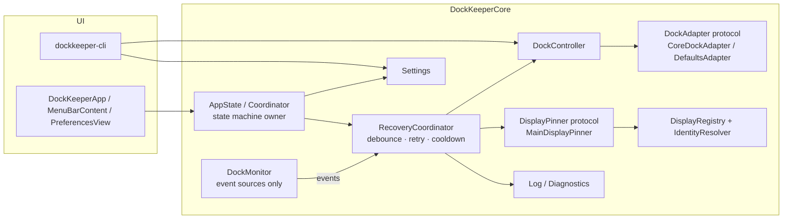
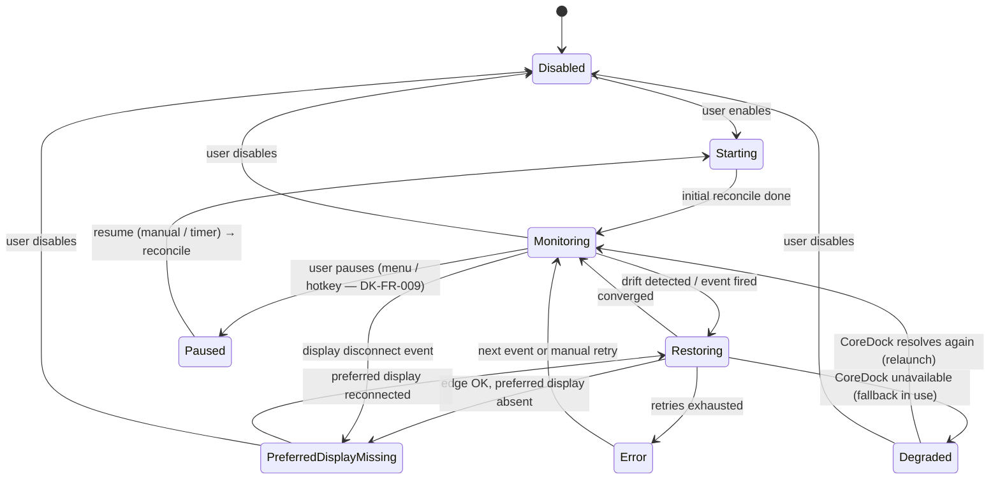

# DockKeeper — Technical Design Document

| | |
|---|---|
| **Status** | Draft for review |
| **Date** | 2026-07-22 |
| **Owner** | blamechris |
| **Scope** | v1.0 (edge lock + best-effort preferred display) and the hardening work between the current v0.1 scaffold and v1.0 |
| **Inputs** | [Preferred-display spike](spikes/preferred-display-spike.md) (owner decisions recorded 2026-07-22), the DockKeeper Agent Kickoff Package, the v0.1 codebase |

Every product or technical claim in this document carries one of the kickoff package's evidence labels:

- **CONFIRMED** — verified on-device, by Apple documentation, or by a reproducible experiment
- **INFERRED** — reasoned from confirmed facts, not yet observed
- **PROPOSED** — a design choice this document is making
- **UNKNOWN** — needs investigation before it can be relied on

---

## Fork amendment: side-Dock host verification (2026-10-02)

**CONFIRMED:** the ADR-009 main-display assumption does not hold universally.
With the LG main/right and the laptop left on macOS 27.0.1, a left Dock stays on
the laptop. See [the bounded hardware experiments](spikes/side-dock-display.md)
and fork ADR-F001 in the decision log.

`DisplaySnapshot` now carries the observed edge and optional host display ID.
`DockHostDetector.live` is the read-only system adapter; rectangle matching is
pure. It reads public on-screen window metadata for this session's Dock PID at
the Dock window level. A single unambiguous display-sized canvas identifies the
host; missing, nonmatching or conflicting canvases produce unknown. No titles,
screenshot pixels, permission prompts, new private APIs or timers are used.
The production snapshot is captured on the existing full-reconcile path.
Diagnostics uses the same snapshot and pure decision via `DockPlacementReport`.

A known side-edge mismatch on an already-main target is terminal and visible;
repeated reconfiguration cannot be justified by a matching main-display ID.
Unknown observation is not success. This is an observation/reporting fix, **not
a relocation fix**. The older universal main-display claims below are historical
assumptions, narrowed by this amendment. Bottom-Dock behavior is unchanged.

## 1. Executive Summary

**The problem.** macOS relocates the Dock — after sleep/wake, display plug/unplug, resolution and arrangement changes — and offers no built-in way to say "keep the Dock here." Commercial utilities that fix this are paid, closed-source, and often subscription-gated. DockKeeper is a free, MIT-licensed, native alternative with no telemetry, no accounts, and no network use.

**The approach.** A menu-bar accessory app plus a CLI, both driving a shared engine (`DockKeeperCore`):

- **Edge lock** (the headline, always-reliable feature): the Dock's edge (bottom/left/right) is read and set live via the private `CoreDock` C API, resolved at runtime with `dlsym`, with a `defaults write com.apple.dock orientation` + `killall Dock` fallback if the symbols ever disappear. CONFIRMED working on-device.
- **Preferred display** (best-effort): the Dock lives on macOS's *main* display, so pinning is implemented by making the chosen display the main display via public `CGDisplayConfiguration` APIs. This also moves the menu bar — an accepted, documented consequence — and is declined (with an explanation) when "Displays have separate Spaces" is on. Owner decisions 1–3 in the spike. Mechanism CONFIRMED available; multi-monitor behavior INFERRED, not yet hardware-verified.
- **Recovery**: event-driven monitoring (wake, display reconfiguration, Space changes, session activation) with a low-frequency polling safety net.

**Major constraints.**

1. There is **no public API to set the Dock's display or edge**; `CoreDock` is private, and the only public path to a different display is relocating the main display. CONFIRMED (spike).
2. "Displays have separate Spaces" (macOS default: ON) makes the Dock per-display/pointer-following; DockKeeper does not fight the OS in that mode. CONFIRMED default, owner Decision 2A.
3. Private-API use and `killall Dock` make the **App Sandbox / Mac App Store non-viable** for v1. INFERRED (see §13).

**Major unresolved risks.** Multi-monitor pinning behavior is only partly observed on real hardware (the dev rig is a MacBook Pro plus a DELL G3223Q whose native arrangement is *stacked*, so free-bottom-edge cells need a deliberate rearrange); display-UUID stability across reconnects/adapters is UNKNOWN; `CoreDock` symbols could change in a future macOS (mitigated by the fallback path).

**Why this approach.** Every alternative was worse: Accessibility-driven Dock dragging needs a heavyweight permission and is fragile; `defaults`+restart as the *primary* mechanism flickers and kills Dock state; private SkyLight pinning was explicitly rejected by the owner. The chosen design keeps the reliable 90% (edge lock) on a proven mechanism with a public-API fallback, and ships the honest 10% (pinning) as clearly-communicated best-effort. **No Accessibility permission is required by default** (§10) — a significant simplification over the kickoff package's assumptions. Two opt-in features do ask for one: window restore (ADR-010) and the bottom-Dock guard (ADR-015). The guard is the one place cursor-warping was adopted, and only in the narrow, fail-open form ADR-015 sets out — it holds the pointer out of a band rather than driving it anywhere.

---

## 2. Goals and Non-Goals

### Goals (v1.0)

| ID (seed) | Goal |
|---|---|
| DK-FR-001 | Lock the Dock to a chosen edge (bottom/left/right) and restore it whenever macOS moves it |
| DK-FR-002 | Best-effort preferred-display pinning via main-display relocation, honestly gated and explained |
| DK-FR-003 | Recover after sleep/wake, display connect/disconnect, resolution and arrangement changes |
| DK-FR-004 | Enable/disable at any time; disabled means DockKeeper touches nothing |
| DK-FR-005 | Launch at Login via `SMAppService` |
| DK-FR-006 | Menu-bar controls (accessory app, no Dock icon) + Preferences window |
| DK-FR-007 | CLI (`dockkeeper lock/unlock/status`) sharing the same engine and settings |
| DK-NFR-001 | ~0% idle CPU, no visible Dock oscillation, no flicker on the primary path |
| DK-NFR-002 | Zero network communication during normal operation |
| DK-PRIV-001 | No telemetry, analytics, or accounts; local logs only, opt-in verbose |

(Seed IDs to be formalized in `docs/behavior-specification.md`; see Appendix B.)

### Non-Goals (v1.0)

- Follow-mouse / follow-focused-window / follow-active-app modes (deferred; follow-window would extend the Accessibility permission the two opt-in features already ask for to the default configuration, which is the line §10 holds)
- Window management or display-arrangement management as a feature
- Apple Shortcuts, Raycast, AppleScript integration — *update: Apple Shortcuts (App Intents) + a `dockkeeper://` URL scheme **shipped for v1.1** as [DK-FR-010](behavior-specification.md#dk-fr-010-apple-shortcuts--url-scheme-automation) (parity gap G6, public APIs, zero permission); Raycast (G7) and AppleScript remain deferred.*
- Per-app rules, display profiles, work/home automation
- Mac App Store distribution (blocked by mechanism choices, §13)
- Auto-update (v1 ships via Homebrew/direct download; Sparkle is a later ADR)
- Cloud sync, accounts, remote configuration, enterprise management, plugins
- Fighting "Displays have separate Spaces": when ON, pinning is declined and explained (Decision 2A)
- Perfect pinning in every topology — "reliable and honest" beats "beats every macOS limitation" (Decision 3)

---

## 3. System Context



Interactions worth noting:

- **Dock**: never touched directly; always via `CoreDock` (live) or its own preferences + restart (fallback).
- **Accessibility services**: not needed by the *default* configuration, and used by exactly two **opt-in** features (§10) — window restore (ADR-010) and the bottom-Dock guard (ADR-015, §10a). The kickoff package anticipated a required grant; the chosen mechanisms make it optional instead of unnecessary.
- **System Settings**: only ever *opened for* the user (Login Items approval); nothing is changed on their behalf.
- **Network**: no component makes network requests. The "Support Development" menu item opens the GitHub page in the user's browser — the only outbound anything, and it is user-initiated. CONFIRMED (code inspection).

---

## 4. Architecture

### 4.1 Component inventory

The kickoff package proposed eleven components. The table maps each to what exists in v0.1 and what v1.0 needs. Status: ✅ built · 🟡 partial · ❌ missing.

| Kickoff component | v0.1 counterpart | Status | v1.0 work |
|---|---|---|---|
| ApplicationCoordinator | `AppState` (app), `main.swift` (CLI) | 🟡 | Absorb state machine (§6); observe external `UserDefaults` changes so CLI edits reflect in the running app |
| DockPlacementController | `DockController` | ✅ | Put `CoreDock`/defaults/`killall` behind a `DockAdapter` protocol for testability |
| DockStateObserver | `DockMonitor` | 🟡 | Split observation from recovery; add debounce/coalescing; detect Dock process restart |
| DisplayRegistry | `DisplayManager` | 🟡 | Cache snapshots; emit change events; real display names via `NSScreen.localizedName` |
| DisplayIdentityResolver | `DisplayIdentityResolver` + `FingerprintMatcher` | ✅ (2026-07-23) | Fingerprint + scored matching + repair shipped (§7); thresholds tune on M6 hardware |
| RecoveryCoordinator | inlined in `DockMonitor.restoreSoon` + poll | ❌ | Extract: single owner of reconciliation with retry ladder, cooldown, oscillation guard (§8) |
| PermissionManager | — | n/a | Not needed for v1 (§10); introduce only if follow-window ships later |
| LoginItemManager | `LoginItemManager` | ✅ | — |
| PreferencesStore | `Settings` | ✅ | Add new keys (§12); schema-version key for future migration |
| MenuBarController | `DockKeeperApp` + `MenuBarContent` | 🟡 | Distinct enabled/disabled icon; honor (or remove) the unused `showMenuBarIcon` setting |
| DiagnosticsLogger | `Log` (os.Logger) | 🟡 | Optional bounded on-disk diagnostics file + export action (§12, §11) |
| — (not in the kickoff package) | `InstanceGuard` (core, pure) + `SingleInstance` (app adapter) | ✅ (2026-08-17) | Single-instance guard: decide-and-yield at `DockKeeperApp.init()` before any engine or status item exists (DK-FR-012, ADR-012) |

**Why a twelfth component.** The kickoff inventory has no process-lifecycle component and §5.1's state model has no notion of a second instance, because §9 states the single-owner property as a fact about *this* process: *"There is exactly one owner of reconciliation state (the coordinator), satisfying the kickoff's 'single owner' requirement."* That is an **in-process** guarantee — `@MainActor` and a generation counter enforce it between tasks, and nothing enforces it between *processes*. Two DockKeeper instances give the user two coordinators, two poll timers and two `CoreDock` writers with no arbiter, and LaunchServices does not prevent that (it dedupes on the bundle's **inode identity**, so a rebuilt, upgraded-in-place, or second-path copy is a different application to it — ADR-012). `InstanceGuard`/`SingleInstance` is the inter-process enforcement of the invariant §9 currently only assumes. Split per rule 8: the whole decision (a total order over `(hasStartTime, startTime, pid)`) is pure and lives in `DockKeeperCore` so the test target can reach it; the `NSRunningApplication` read, the kernel start-time substitution (`sysctl` `KERN_PROC_PID`, needed because a directly-`exec`ed bundle binary has no LaunchServices launch date in anyone's view) and the `exit()` stay in the app-target adapter. Scope is the menu-bar app only — `dockkeeper-cli` and `StatusSummary.live()` are legitimate separate processes and must never be guarded.

### 4.2 Target component diagram



### 4.3 Per-component contracts

For each component: responsibility / inputs / outputs / dependencies / threading / failure modes / test seam.

**DockController** — decides whether the Dock needs moving and applies the edge.
Inputs: desired `DockOrientation`, `Settings`. Outputs: applied/no-op, current orientation. Depends on `DockAdapter`. Threading: callable from any context today (`@unchecked Sendable`); PROPOSED: invoked only by `RecoveryCoordinator` (main actor) and the CLI. Failure modes: adapter read returns nil (unknown state — treat as drift, apply); private API vanished (fall back, log `Degraded`). Test seam: inject a fake `DockAdapter` recording get/set calls. **(Seam missing in v0.1 — `CoreDock` is a static enum and `killall` is spawned inline. Priority refactor.)**

**CoreDockAdapter (`CoreDock`)** — runtime-resolved private `CoreDockGet/SetOrientationAndPinning`.
CONFIRMED: symbols resolve and work live, flicker-free, on-device — *but only when HIServices/AppKit is loaded in the process*. The CLI currently gets this transitively; the spike recommends an explicit `dlopen` of HIServices to remove the hidden link-order dependency. PROPOSED: do that hardening now (cheap, spike-validated).

**DefaultsAdapter** — `defaults write com.apple.dock orientation` + `killall Dock`.
Robust but restarts the Dock (visible). Used only when `CoreDock` is unavailable → app enters `Degraded` state and says so in the menu.

**DockMonitor** — event sources only (post-refactor): workspace notifications, screen-parameter notification, `CGDisplayRegisterReconfigurationCallback`, Dock-restart detection (§8.5). Outputs: typed `DockEvent` values to the coordinator. Main actor. Failure mode: callback registration fails → poll covers the gap. Test seam: events are plain values; the coordinator is tested by feeding synthetic sequences.

**RecoveryCoordinator** (new) — the *single owner* of reconciliation. Consumes events, applies debounce/coalescing, runs the retry ladder, enforces cooldown and the oscillation guard, invokes `DockController` and `DisplayPinner`, transitions the state machine. Main actor; pure decision core (`decide(state, event, now) -> [Action]`) unit-testable with no system dependencies. This is where most of the kickoff package's §6.8 requirements land.

**DisplayRegistry / DisplayIdentityResolver** — enumeration (`CGGetActiveDisplayList`, CONFIRMED), UUID mapping (`CGDisplayCreateUUIDFromDisplayID`, CONFIRMED), plus the fingerprint/scored-matching design in §7.

**MainDisplayPinner** — implements `DisplayPinner`. Pure `decide(snapshot, targetUUID)` (unit-tested today, ✅) + injected `applyMain` closure performing the `CGDisplayConfiguration` transaction. Failure modes are typed (`PinOutcome`) and every non-`pinned` case is a safe no-op with user-facing copy.

**LoginItemManager** — `SMAppService.mainApp`; system is the source of truth; maps `.requiresApproval`/`.notFound` to user guidance. CONFIRMED working; `.notFound` occurs under `swift run` because `SMAppService` needs the packaged `.app` (documented in-code).

**Settings** — `UserDefaults`-backed, registration-domain defaults, no SwiftUI dependency so the CLI can use it. ✅

**Log / Diagnostics** — `os.Logger` subsystem `com.dockkeeper.app` (on-device only, viewable in Console). PROPOSED addition: opt-in bounded file diagnostics (§12) because os_log retention is short and users filing GitHub issues need something to attach.

---

## 5. Dock State Model

### 5.1 Application state machine

The kickoff package's state list, adapted: `Awaiting Permission` is not a top-level app state. Two opt-in features await Accessibility (§10), but each surfaces its own waiting caption beside its own toggle rather than putting the whole app into a permission state — the app is fully functional without either.



States (all PROPOSED except where noted):

| State | Meaning | User-visible |
|---|---|---|
| Disabled | `Settings.isEnabled == false`; no observers, no timers, zero footprint | Menu toggle off (exists in v0.1) |
| Starting | Observers registering, initial reconcile scheduled | — |
| Monitoring | Steady state; event-driven, poll safety net | Normal icon |
| Restoring | A reconcile pass is in flight (retry ladder may be active) | — (must be invisible; no oscillation) |
| PreferredDisplayMissing | Edge enforced; pin target not connected — **no fallback pinning occurs** (§7.4) | Menu note: "preferred display isn't connected" (copy exists in v0.1) |
| Degraded | Private API unavailable; `defaults`+restart fallback active | Menu note; CLI `status` already reports this (v0.1 ✅) |
| Paused | Temporarily suspended without losing settings ("Pause for 15 Minutes" / "1 Hour" / "Until Resumed"; optional ⌃⌥⌘D hotkey) — corrections stop until resume, then a full reconcile re-enforces. Reachable only from a non-disabled state; resume routes back through `Starting`. Implemented 2026-07-23 (DK-FR-009, M10) | Distinct icon (`pause.rectangle`) |
| Error | Retry ladder exhausted without convergence | Menu note + last error |

### 5.2 Tracked state

| Field | Source | v0.1 |
|---|---|---|
| Current Dock edge | `CoreDock.current()` → fallback `com.apple.dock` defaults read | ✅ |
| Desired Dock edge | `Settings.lockEdge` | ✅ |
| Current main display | `CGMainDisplayID()` | ✅ |
| Preferred display | `Settings.preferredDisplayUUID` (fingerprint in v1, §7) | 🟡 UUID only |
| Separate-Spaces flag | `com.apple.spaces` `spans-displays` read | ✅ |
| Dock autohide | `CoreDockGetAutoHideEnabled` resolves (CONFIRMED, spike). Read-only awareness for the recovery engine, which never touches it — but **DK-FR-011 does borrow it**: `ScreenShareHider` turns it on for the duration of a screen capture and off again afterwards, outside the coordinator (ADR-011 "Coordinator interaction"). Provenance across a process boundary is persisted, not held in memory (§11.1, ADR-013) | ✅ (2026-07-23, DK-FR-011); durable record 2026-08-17 |
| Pending restoration / attempt count / last outcome | RecoveryCoordinator | ❌ (needed for retry/cooldown) |
| Last pin outcome | `AppState.lastPinMessage` | ✅ |
| Login item status | `SMAppService.mainApp.status` (system is source of truth) | ✅ |

### 5.3 Reconciling incomplete or conflicting information

- `CoreDock.current()` returning nil (unresolvable symbols or unrecognized raw values) → treat orientation as **unknown**, fall back to the defaults read; if both fail, treat as drift and apply the desired edge (applying is idempotent and safe). PROPOSED.
- The defaults read can be **stale** relative to live Dock state (the Dock caches; `defaults` lags `CoreDock` writes). The live read always wins when available. INFERRED — verify with an experiment before relying on defaults reads for drift detection in `Degraded` state.
- During display reconfiguration, `CGMainDisplayID()` and `NSScreen.screens` can momentarily disagree with final layout. All decisions are made on a **snapshot** (`DisplaySnapshot`) captured at decision time, never on live queries mid-decision; the retry ladder re-snapshots. PROPOSED (snapshot pattern already exists for the pinner ✅).

---

## 6. (merged into §5)

*Numbering in this document follows content, not the kickoff outline, where merging avoided duplication. Appendix A maps every kickoff-required section to where it is covered.*

---

## 7. Display Identity

### 7.1 Available identifiers

| Identifier | API | Persistence | Status |
|---|---|---|---|
| Display UUID | `CGDisplayCreateUUIDFromDisplayID` | Survives reboots for the same display on the same connection in common cases | CONFIRMED available; **stability across reconnects/adapters/docks UNKNOWN** (single-display rig; kickoff explicitly warns not to assume) |
| CGDirectDisplayID | `CGGetActiveDisplayList` | **Not stable** across reconnects/reboots | CONFIRMED (Apple docs) |
| Vendor / model / serial | `CGDisplayVendorNumber` / `ModelNumber` / `SerialNumber` | Stable per panel; serial frequently 0 for consumer displays | CONFIRMED APIs exist; serial reliability INFERRED |
| Localized name | `NSScreen.localizedName` (matched via `NSScreenNumber`) | Human-stable ("DELL U2720Q") | CONFIRMED API (macOS 10.15+) |
| Built-in flag | `CGDisplayIsBuiltin` | Stable | CONFIRMED |

~~v0.1 stores the UUID string only and falls back to `"cg-<id>"`~~ **Fixed 2026-07-23**: preferences store the full `DisplayFingerprint`; `"cg-<id>"` placeholders are UI-only and discarded on migration; display names come from `NSScreen.localizedName`.

### 7.2 Fingerprint + scored matching (PROPOSED)

```swift
struct DisplayFingerprint: Codable {
    let uuid: String?
    let vendorNumber: UInt32?
    let modelNumber: UInt32?
    let serialNumber: UInt32?   // often 0 — treat 0 as absent
    let localizedName: String?
    let isBuiltin: Bool
}
```

Matching a stored fingerprint against connected displays:

| Evidence | Score |
|---|---|
| UUID exact match | 100 |
| vendor + model + serial (serial ≠ 0) | 85 |
| vendor + model + localizedName | 70 |
| vendor + model only | 50 |
| isBuiltin both true | 95 (there is at most one built-in) |

Accept the best candidate iff score ≥ 70 **and** it is the unique maximum. Two identical externals with serial 0 both score 50/70 and tie → ambiguous → treat as not-matched and surface "pick your preferred display again" rather than guessing. PROPOSED; thresholds to be tuned on hardware.

### 7.3 Stale-preference repair

When a fingerprint matches on fallback evidence but the stored UUID differs from the live UUID (dock/adapter changed the UUID), **rewrite the stored fingerprint** with the fresh values and log the repair. The preference heals instead of rotting.

### 7.4 When the preferred display is absent

**No fallback display is selected.** The Dock stays wherever macOS puts it (edge still enforced), state = `PreferredDisplayMissing`, and the pin re-applies on reconnect. Picking a "second best" display would surprise the user. PROPOSED (consistent with v0.1's `displayNotConnected` no-op behavior ✅).

---

## 8. Event Model & Recovery Algorithm

### 8.1 Event catalog

| Event | Source | v0.1 | Action |
|---|---|---|---|
| App launch / enable | — | ✅ | Full reconcile (edge + pin) after settle delay |
| Wake from sleep | `NSWorkspace.didWakeNotification` | ✅ | Reconcile with retry ladder (displays may not be ready — §8.4) |
| Screens wake | `NSWorkspace.screensDidWakeNotification` | ✅ | Reconcile |
| Display connect/disconnect/mode/desktop-shape | `CGDisplayRegisterReconfigurationCallback` (filtered to completed changes) | ✅ | Re-snapshot displays; reconcile; may enter/exit `PreferredDisplayMissing` |
| Resolution / arrangement changed | `NSApplication.didChangeScreenParametersNotification` | ✅ | Reconcile (coalesced with the CG callback — these fire together) |
| Active Space changed | `NSWorkspace.activeSpaceDidChangeNotification` | ✅ | Reconcile edge only (cheap read; usually no-op) |
| Session became active (fast user switching) | `NSWorkspace.sessionDidBecomeActiveNotification` | ✅ | Reconcile |
| Dock process restarted | ~~detection needed~~ **Resolved 2026-07-22**: spike CONFIRMED `CoreDockSet` writes through to defaults, so a restarted Dock re-reads the edge we set — restarts are benign; no detection mechanism needed (poll covers residual gaps) | n/a | — |
| Preference changed externally (CLI while app runs) | KVO on `UserDefaults` / `didChangeNotification` | ❌ | Refresh published state; reconcile if desired edge changed |
| Poll tick (safety net) | `Timer` | ✅ (2 s — too aggressive, see §8.6) | Silent drift check |
| Permission events | n/a in v1 | — | — |
| Fullscreen transition / focused-window change | not observed | — | Deliberately ignored in v1 (no follow-modes); fullscreen races are handled by the retry ladder, not by tracking fullscreen state |

### 8.2 v0.1 weaknesses this design fixes

1. **No coalescing**: every event schedules its own `asyncAfter(restoreDelay)`; a display reconfiguration burst (which fires the CG callback + screen-parameters + possibly space-change within milliseconds) stacks several overlapping restore attempts. Harmless today only because applies are idempotent — but it multiplies pin attempts, and each pin can itself emit a reconfiguration event.
2. **Feedback-loop exposure**: `MainDisplayPinner` completing a configuration *causes* a display-reconfiguration event, which triggers another reconcile. It converges (second pass hits `alreadyOnTarget`) — INFERRED, not proven — but the design should not rely on convergence-by-luck. The coordinator must mark self-caused reconfigurations and swallow their echoes.
3. **Fixed single delay**: one 0.4 s settle delay, no retries — a wake where displays come up slowly gets exactly one (possibly too-early) attempt, then waits for the 2 s poll to paper over it.
4. **No cooldown / oscillation guard**: if some other agent (another utility, a corporate profile) keeps moving the Dock, v0.1 fights it every 2 s forever, silently.

### 8.3 Reconciliation pseudocode (PROPOSED)

```text
on event e:
    if state in {Disabled, Paused}: return
    if e is displayReconfiguration and e.timestamp within ECHO_WINDOW
       of lastSelfInflictedReconfigure: return            # swallow our own echo
    pendingGeneration += 1
    schedule reconcile(gen: pendingGeneration) after DEBOUNCE (250–500 ms)
    # a newer event bumps the generation; stale reconciles no-op

reconcile(gen):
    if gen != pendingGeneration: return                    # coalesced away
    state = Restoring
    for attempt in retryLadder:                            # e.g. [0s, +1.5s, +4s]
        snapshot = captureSnapshot()                       # displays, main, edge, spaces
        actions = decide(snapshot, settings)               # pure function
        if actions is empty:
            state = deriveSteadyState(snapshot)            # Monitoring or PreferredDisplayMissing
            resetCooldownWindow(); return
        if cooldownExceeded():                             # e.g. >6 corrections in 60 s
            log oscillation warning; state = Error; return
        for a in actions:
            apply(a)                                       # setEdge via DockAdapter, or pin
            if a is pin: lastSelfInflictedReconfigure = now
        recordCorrection()
        wait attempt.delay                                 # then loop to verify convergence
    state = Error                                          # ladder exhausted

decide(snapshot, settings) -> [Action]:                    # PURE — unit-test target
    actions = []
    if snapshot.edge != settings.lockEdge: actions += setEdge(settings.lockEdge)
    if settings.preferredFingerprint != nil:
        match MainDisplayPinner.decide(snapshot, resolved(preferred)):
            .reconfigure(id) -> actions += pin(id)
            .terminal(_)     -> ()                         # no-op outcomes; message surfaced separately
    return actions
```

Key properties: **one reconcile in flight** (generation counter), **bounded work per event burst** (debounce), **verified convergence** (ladder re-checks after applying), **loop breaker** (cooldown budget), **echo suppression** (self-inflicted reconfigure window).

### 8.4 Timing parameters

| Parameter | Default | Rationale |
|---|---|---|
| Debounce window | 400 ms | Events around a display change arrive in bursts; UNKNOWN exact spread — measure in a spike |
| Retry ladder | 0 s, +1.5 s, +4 s | Covers wake-before-displays-ready; PROPOSED, tune on hardware |
| Echo window | 2 s after self-caused reconfigure | INFERRED sufficient |
| Cooldown budget | max 6 corrections per 60 s → `Error` | Prevents infinite fights; user-visible |
| Poll interval | **30 s** (v0.1: 2 s — change) | See §8.6 |

All PROPOSED and stored in `Settings` (the keys exist: `restoreDelay`, `recoveryInterval`) so field-tuning needs no release.

### 8.5 Dock restart

**Resolved 2026-07-22 — CONFIRMED benign.** The on-device spike ([findings](spikes/coredock-defaults-persistence.md)) showed a live `CoreDock` set writes through to the `com.apple.dock` defaults within ~1.5 s (it even creates the key when unset). A restarted Dock therefore re-reads exactly the edge we last set: no mirroring, no Dock-restart detection needed.

### 8.6 Polling policy

Kickoff principle 19: no continuous polling unless events are shown insufficient. v0.1 polls every **2 s**, which inverts the burden of proof. The work per tick is two C calls (INFERRED negligible), but the principled design is:

- Events are primary; the poll is a **safety net for event gaps only** (missed callbacks, Dock restarts until §8.5 lands, anything unobserved).
- Default interval 30 s. A wrong Dock edge for ≤30 s in the rare unobserved case is acceptable; burning wakeups every 2 s forever is not.
- Record (locally) whenever the *poll* — not an event — catches drift. If hardware testing shows real gaps, shorten with evidence in hand. → ADR-005 (hybrid monitoring).

---

## 9. Concurrency

- **Main actor owns everything mutable.** `AppState`, `DockMonitor`, and the new `RecoveryCoordinator` are `@MainActor`. There is exactly one owner of reconciliation state (the coordinator), satisfying the kickoff's "single owner" requirement. The workload is trivially small; there is no justification for background queues and their races.
- **Pure cores.** `MainDisplayPinner.decide` (exists ✅) and `RecoveryCoordinator.decide` (new) are pure synchronous functions — no actors, no awaits — so tests need no concurrency machinery.
- **CG callback trampoline.** `CGDisplayRegisterReconfigurationCallback` invokes a C callback; v0.1 hops to the main actor via `Task { @MainActor in ... }` (✅ correct). The `Unmanaged.passUnretained` pattern requires `stop()` before release; v0.1 documents this. PROPOSED hardening: coordinator owns monitor lifetime explicitly (start/stop paired with state transitions).
- **Overlap protection** comes from the generation counter (§8.3), not locks: a reconcile that awaits its ladder delay re-checks its generation on resume and abandons itself if superseded. Cancellation is cooperative and trivial.
- **`DockController` Sendable status**: currently `@unchecked Sendable` so the CLI (no main actor) can use it. Acceptable: it is stateless apart from injected `Settings`, and `Settings`/`UserDefaults` are thread-safe. Document rather than fight.
- **Timers**: the poll timer runs on the main run loop in `.common` mode (✅ survives menu tracking).

---

## 10. Permissions

**The default configuration requires no privacy-gated permission at all.** This is a meaningful improvement over the kickoff package's assumption that Accessibility permission was likely. Exactly two **optional, opt-in** features touch a TCC permission — window restore (ADR-010) and the bottom-Dock guard (ADR-015) — and only when the user turns them on. Neither is on by default, and each shows a contextual explanation before its one prompt.

| Mechanism | Permission | Status |
|---|---|---|
| `CoreDock` get/set via `dlsym` | None | CONFIRMED on-device (works with no Accessibility grant) |
| `defaults` read/write `com.apple.dock` + `killall Dock` | None (outside sandbox) | CONFIRMED (standard Unix; same-user signal) |
| `CGGetActiveDisplayList` / UUIDs / `CGDisplayConfiguration` | None | CONFIRMED (public CG API; no TCC prompt) |
| `CGWindowListCopyWindowInfo` (read window geometry for restore) | None | CONFIRMED (public CG API; reading is permission-free) |
| Workspace/display notifications | None | CONFIRMED |
| `SMAppService` login item | User approval in System Settings (not a TCC permission) | CONFIRMED; `.requiresApproval` is detected and the app deep-links the user to the Login Items pane with an explanation (✅ v0.1) |
| Accessibility (AX) — **opt-in window restore** (ADR-010) | Accessibility, requested only if the user enables "Keep windows in place when pinning" | CONFIRMED required to *move* another app's window (`AXUIElementSetAttributeValue`/`kAXPositionAttribute`); off by default. Contextual explanation shown before the one prompt; revocation/denial = silent no-op + a "waiting for permission" caption with a deep link to the Accessibility pane. The preserver never prompts — the UI owns that (INFERRED coordinate-system assumption pending hardware validation) |
| Accessibility (AX) — **opt-in bottom-Dock guard** (ADR-015, §10a) | Accessibility, requested only if the user enables "Keep a bottom Dock on my preferred display" | CONFIRMED required for a `CGEventTap` that can *modify* events: without the grant `CGEventTapCreate` yields a tap that never fires. Off by default. `BottomDockGuard.decide` reports `.accessibilityNotGranted` rather than failing silently, and the toggle offers a deep link to the Accessibility pane. Fails **open** in every degraded state — no grant, refused tap, revoked grant, system-disabled tap — because the failure that matters is a trapped cursor, not an unguarded Dock |

Consequences:

- The default remains no-onboarding, no-`PermissionManager` — the zero-permission story is intact for every user who doesn't opt in.
- Window restore realizes the kickoff's full permission model *feature-scoped*: contextual explanation before prompting, one prompt on enable, denial/revocation handled as a graceful no-op with a caption note and a deep link — no `Awaiting Permission` app state, because the feature degrades in place rather than blocking the app.
- The `Log.accessibility` category (previously reserved) is now used by `WindowLayoutPreserver` — count-only, no window titles or app names (§12). The still-future follow-window feature would extend, not introduce, this permission posture.

---


### 10a. Bottom-Dock guard (DK-FR-014 / ADR-015)

The one mechanism that keeps a **bottom** Dock on a chosen display when
*Displays have separate Spaces* is on. macOS hands a bottom Dock to whichever
display the pointer summons it to, and no API moves it back — every relocation
mechanism was tested and refuted on hardware (the [spike](spikes/separate-spaces-pinning.md)).
So the guard **prevents the summon** instead of reversing it.

**Split.** The decision is pure and lives in `DockKeeperCore`
(`BottomDockGuard.decide`); the effect is an adapter in the app target
(`BottomDockGuardTap`). The decision function takes a `Snapshot` — displays,
preferred display, dock edge, separate-Spaces state, `appEnabled`,
`featureEnabled`, `accessibilityTrusted` — and returns either
`.idle(IdleReason)` or `.guarding(zones:skipped:)`. Every input is a value, so
the whole policy is unit-testable with no display hardware.

**Disqualification order is load-bearing.** App off → feature off → edge not
bottom → separate Spaces off → single display → no preferred display →
preferred display absent → Accessibility not granted → *then* geometry. Settings
are evaluated before arrangement so a refusal always names the cause the user
can act on, rather than blaming their monitors for a switch they left off.
`appEnabled` and `featureEnabled` are carried separately, and required rather
than defaulted, so a report can say which of the two switches is off (#63); the
"required, not defaulted" part is the rule #65 established for guard inputs.

**Geometry.** A `ClampZone` is emitted for each **free horizontal span** of each
**non-preferred** display's bottom edge — each stretch with no other display
beneath it (`freeBottomSpans`). "Beneath" is one shared `isBeneath` predicate,
deliberately **one-sided**: a neighbour whose frame *overlaps* the edge blocks it
just as a flush one does, because its rectangle covers ground at or above that
edge. v0.9.3 compared by absolute distance and so ignored an overlapping
neighbour entirely; that is fixed with #83. The tap pulls a pointer inside that band
back to `maxY − 3`, altering `y` only. The spans *shared* with a display beneath
are skipped, because they are the pointer's route between the two screens and
holding one would trap the cursor; when a display has no free span at all it is
skipped whole, and when that leaves nothing to guard the decision is
`.idle(.nothingToGuard)`. Mirrors of the preferred display are skipped for a
different reason: same pixels, so a band on the "other" display lands on the one
the user is looking at.

Per-span rather than per-display since [#83](https://github.com/blamechris/DockKeeper/issues/83)
— a whole-display refusal abandoned ~2112 px of the owner's own 3840 px bottom
edge to protect a 1728 px crossing strip. A zone is a sub-rectangle of the
display it names, narrowed in `x` only, so `clampY` and `contains`'s `frame.maxY`
bound still describe that display and the blast-radius argument below is
unchanged. The safety property is asserted as an invariant over whole
arrangements — *no emitted band ever overlaps a display flush beneath it* — and
the interval arithmetic is held to `bottomEdgeIsFree`, which has none in it, by a
differential test. `Decision.guarding` carries `partiallyGuarded` alongside
`skipped` so a partly-covered display is never reported as fully guarded.

**Fail open, always.** No grant, refused tap, revoked grant, system-disabled tap
— every degraded state releases the pointer. The failure that matters here is a
trapped cursor, not an unguarded Dock. An event tap is process-owned, so unlike
ADR-013's borrowed auto-hide there is **no persisted state and no launch
repair**: kill the process by any route and the pointer moves normally.

**Known costs**, all recorded rather than mitigated: the Dock cannot be
summoned on a guarded span (the feature working; the bottom hot corners there
were listed here too and are withdrawn — a guarded corner still fired on the one
rig measured, §3d row 7, [#99](https://github.com/blamechris/DockKeeper/issues/99)); pause does **not** release the guard (pause
suspends corrections, and prevention has no correction to resume — DK-FR-009 S2
does not hold for a guarded display while this is on); and every pointer
movement crosses the tap's callback on the main run loop while armed, which is
the first continuous-cost mechanism in the app and is unmeasured against
DK-NFR-001 (M6).

**Evidence status.** That the clamp holds the pointer is CONFIRMED with a
control (ADR-015). That a *real hand* cannot therefore complete the summon is
**INFERRED** — it needs a two-display rig with free bottom edges, and is an open
obligation, not a shipped claim. §3d of the [test strategy](test-strategy.md)
carries the row.

## 11. Persistence

`UserDefaults` (standard domain for the app/CLI; both processes share it because they run as the same user — CONFIRMED by the shared-`Settings` design working across app and CLI).

| Key | Default | Exists | Notes |
|---|---|---|---|
| `enabled` | `true` | ✅ | |
| `lockEdge` | `.bottom` | ✅ | Int raw value matching CoreDock integers |
| `preferredDisplayUUID` | nil | ✅ legacy | Superseded 2026-07-23 by `preferredDisplayFingerprint` (Codable, §7.2); migrated write-once (`"cg-"` values discarded) and mirrored for rollback until v1.1 |
| `preferredDisplayFingerprint` | nil | ✅ | JSON-encoded `DisplayFingerprint` (ADR-004) |
| `autoRecover` | `true` | ✅ | Gates the poll only in v0.1 — **retire per ADR-007** (2026-07-22): `enabled` is the single switch; key removed with M4 |
| `launchAtLogin` | `false` | ✅ | Mirror only — `SMAppService` is the source of truth; keep for UI restore, never trust over the system |
| ~~`showMenuBarIcon`~~ | — | deleted | Removed 2026-07-23 (was dead in v0.1; a menu-bar-only app without its icon is unreachable) |
| `verboseLogging` | `false` | ✅ | Surfaced in Preferences ▸ Advanced (2026-07-23) |
| `restoreDelay` | 0.4 | ✅ | Becomes debounce/ladder base (§8.4) |
| `recoveryInterval` | 30.0 | ✅ | Poll interval per §8.6 (shipped 2026-07-22) |
| `diagnosticsFileEnabled` | `false` | ✅ | Opt-in bounded file log (2026-07-23) |
| `settingsVersion` | 1 | ✅ | Migration hook (2026-07-23). **Not bumped** by `screenShareHideRecord`: the hook is for migrations that reinterpret *existing* keys, and an optional absent-by-default key is compatible in both directions |
| `screenShareHideRecord` | nil | ✅ | JSON-encoded `ScreenShareHideRecord` (`hiddenAt` only) — the durable "DockKeeper is holding Dock auto-hide on right now" breadcrumb (DK-FR-013, ADR-013). **Absent by default and deliberately not registered** (absence is a real state; a registered default cannot be removed) and **deliberately not in `externallyObservedKeys`** (§11.1) |
| `liveGuardRecord` | nil | ✅ | JSON-encoded `LiveGuardRecord` — what a *running* instance holds about the bottom-Dock guard (DK-FR-015, ADR-016, §11.2). Stored as a **`String`, not `Data`**, deliberately unlike the two records above it: "machine-readable" is an acceptance criterion here, and `Data` renders in `defaults read` as a hex blob no support reader can use, so `defaults read com.dockkeeper.app liveGuardRecord` *is* the artifact with no second surface to keep in step. Written by the running app from the tail of `applyBottomDockGuard()` — on a change of decision, held settings, Accessibility, or whether the tap is armed, and on clamp/re-enable **counter movement**; an otherwise-unchanged rewrite is skipped (DK-NFR-001). **Removed on clean exit**, which is what makes a surviving record evidence that its writer was killed rather than quit. **Deliberately not registered** (absence is a real state — nothing is publishing) and **deliberately not in `externallyObservedKeys`** (this app writes it; observing a self-written key turns every publish into a `.settingsChanged` event and a full reconcile — §11.1's argument, third instance) |
| Donation prompt state | — | — | **Deliberately absent.** No automatic donation prompt exists, so no state is needed (kickoff §6.11: default no prompt — we exceed this by having no prompt at all; the "Support Development" menu item is passive) |

Onboarding-completion flag: not needed (no onboarding flow; the app is functional on first launch with zero prompts).

### 11.1 Borrowed system state (DK-FR-013, ADR-013)

`CoreDockSetAutoHideEnabled` writes through to the `com.apple.dock` domain (CONFIRMED — R-011), so DK-FR-011's hide is not a private in-process toggle: it is a **persistent mutation of a global preference owned by another process**, which DockKeeper *borrows* and must give back. The rule this establishes is general, and binds any future feature that borrows a system preference:

> **Any system preference DockKeeper borrows is recorded durably *before* the borrowing write and cleared *after* the restoring write, and restoration never depends on a termination hook.**

**Why not a termination hook.** `AppState.prepareForTermination()` (via `applicationWillTerminate`, plus `TerminationSignals` converting `SIGTERM`/`SIGINT` into an ordinary quit) covers the trappable exits and makes them instant. It is a **latency optimization, not the mechanism**: `SIGKILL`, Force Quit and a crash are untrappable by construction, and for background (`LSUIElement`) processes loginwindow *sends* the Quit Apple Event but does not wait for a reply before killing (INFERRED — Apple, *System Startup Programming Topics*; ADR-013 Evidence). Logout is the highest-frequency real exit path, so a design that depends on the hook is a design that usually loses. `NSSupportsSuddenTermination=false` does **not** buy the wait — it governs the sudden-termination refcount, not loginwindow's patience.

**Ordering, because the two stores cannot be made atomic.** The record lives in `UserDefaults` (via `cfprefsd`) and the borrowed value lives in `com.apple.dock` (via the Dock); there is no transaction spanning them. Ordering plus a free discharge rule replaces atomicity:

| Phase | Order | Killed in between | Cost |
|---|---|---|---|
| Hide | **Write-ahead** — record, then `writeAutoHide(true)` | Record present, auto-hide still off | Next launch **discards**, zero Dock writes |
| Restore | **Write-behind** — `writeAutoHide(false)`, then clear the record only if it succeeded | Record outlives an already-correct Dock | Next launch **discards**, zero Dock writes |
| Failed hide write | Clear the record again | — | Never claim a hide we failed to make |

The record is therefore always a **superset** of "this auto-hide may be ours", and the false positives cost nothing because a launch that reads auto-hide already *off* discards without writing. The opposite hide order — Dock first, record second — is the one that leaves auto-hide on with no record, i.e. the unrecoverable state this exists to remove. Cost is one defaults write per hide and one per restore, i.e. per *capture session*, not per 3 s tick (DK-NFR-001) — which is also why the record is never re-stamped mid-capture, and therefore why a single capture outliving the 7-day window repairs to `discard` (ADR-013, accepted bound).

**`repair` → `decide` hand-off.** Two total pure functions in `DockKeeperCore`, with a stated boundary rather than one bigger table:

- `ScreenShareHider.repair(record:currentAutoHide:capturing:featureActive:now:window:) -> {none, discard, adopt, restore}` answers a **once-per-launch question about provenance across a process boundary**, and runs once from `AppState.init` before any enable/feature gating. `repairIfNeeded` short-circuits on a missing record **before** evaluating either private port, because Swift's eager argument evaluation would otherwise call `CGSIsScreenWatcherPresent` and `CoreDockGetAutoHideEnabled` on every launch — including for the users who never opted in, contradicting DK-FR-011's opt-in guarantee.
- `ScreenShareHider.decide(capturing:weHidIt:currentAutoHide:) -> {none, hide, restore}` answers the **steady-state question every 3 s from three live booleans**, and is **unchanged** — its exhaustive 8-row table is the documented ADR-011 contract, and leaving it byte-identical (CONFIRMED by diff) and passing is the standing proof that the contract survived.

Both functions apply the *same* rule about an unreadable auto-hide: `repair` returns `none` and keeps the record, and `evaluate` — the side-effecting caller of `decide` — returns before deciding at all rather than coalescing an unreadable read to `false`. That symmetry is load-bearing, not tidiness: coalescing would let a launch mint a record and hide the Dock while unable to tell the user's own auto-hide from ours (violating the ADR-011 invariant directly), and would overwrite the very record `repair` had just deliberately preserved for a macOS on which the symbol resolves.

The hand-off is well-formed in all four repair outcomes: after `none`/`discard`/`restore` the in-memory flag is false; after `adopt` it is true **and** auto-hide is known on (the repair's own guard proved it). Both are states `decide`'s table already covers. `featureActive` gates `adopt` because adopting a hide that nothing will later restore would leave the Dock hidden with the record renewed — the bug re-armed — and `adopt` exists at all because restoring during a live capture would show the Dock for up to one poll interval in the middle of a screen share.

`screenShareHideRecord` is kept out of `Settings.externallyObservedKeys` on purpose: this app writes it on every hide and every restore, so observing it would turn each one into a `.settingsChanged` event and a full reconcile, falsifying ADR-011's verified "the auto-hide path never reaches `DockMonitor`/`RecoveryCoordinator`" claim. There is a test asserting its absence.

### 11.2 Published live state (DK-FR-015, ADR-016)

§11.1's record is a **liability**: a system preference DockKeeper borrowed and owes back, whose survival past the process is a bug the next launch repairs. This one is its mirror image — a **claim** about what a running instance holds, whose survival past the process is *evidence* and must never be believed. Both keys live in the same domain and neither may be reasoned about with the other's rules.

**Every guard surface before this one re-derives, and that is why two of them lied.** `--diagnostics` builds a fresh `Settings()`, re-enumerates displays and re-runs `BottomDockGuard.decide` in a process that has never held a tap and structurally never will — `Diagnostics.runIfRequested()` prints and `exit()`s inside `App.init()`, before the `@StateObject` autoclosure that builds `AppState` (the same fact ADR-014 relies on to keep a diagnostics run from destroying pause evidence). The Preferences caption *is* live, but it is a truncated string inside a GUI, and an `LSUIElement` app gives the user nowhere else to look. So the report and the app could disagree, and twice they did: `guarding 1 display(s)` while the tap had never armed, because TCC answers `AXIsProcessTrusted()` for the **responsible** process and a granted terminal was answering on behalf of an un-granted GUI app ([#77](https://github.com/blamechris/DockKeeper/issues/77)); and `off — not enabled in Preferences` while the tap was actively clamping the pointer to `y = -3`, because `lockBottomDockToDisplay` is not in `Settings.externallyObservedKeys` (which is `enabled`, `lockEdge`, `preferredDisplayFingerprint`, and nothing else) so an external `defaults write` to it never reached the running app. Both halves behaved exactly as built. Neither could see the other. This record is the observation they were missing: it is written by the instance that owns the tap, read by anyone, and **nothing in it is derived by the reader**.

**It is a belief, not a proof**, and every surface's wording holds that line. The record says what the running app *thinks*; nothing in it can establish that the tap is really filtering events. What it can do — and what nothing else could — is make the app's belief comparable with the disk, which is precisely the divergence that was invisible.

**Liveness is a kernel question, never a clock question.** The record is stamped with a `ProcessIdentity` — `(pid, startedAtMicroseconds, uid)` from `sysctl(KERN_PROC_PID)` — and a reader's verdict is that triple compared against the live process table. A bare pid cannot carry the question: pids wrap near 99999 (the wrap `InstanceGuard` already reasons about when it ranks peers by start time rather than by pid), so a record naming pid 4242 reads as live the moment any unrelated process is handed 4242. The start time is **whole microseconds as an `Int64`, deliberately not a `Date`**: the entire value of the comparison is that it is exact, and a `Date` is a `Double` of seconds whose JSON round-trip invites a tolerance — a place for a wrong answer to hide. The kernel supplies whole seconds and whole microseconds, so keeping the kernel's units keeps `==` meaning what it says, and a recycled pid is a live process with a strictly *later* start time. The uid rides along because `kinfo_proc` already carries it, so fast-user-switching scoping costs no second syscall (ADR-012's amendment made the same trade): another account's DockKeeper manages a different Dock and is never this session's live state. `classify(stored:writerIdentityNow:readerUID:)` is pure with the kernel injected, which is what makes dead-writer, recycled-pid and foreign-uid reachable from `swift test` with no hardware and nothing to kill. **It consults no clock at all.** An age threshold would need a tolerance, a tolerance is a guess, and a guess is how an instrument starts lying; `observedAt` is reported to the user as freshness and is never evidence of life.

**Only `.live` carries the record.** `LiveGuardReading` has seven cases and six of them carry the writer's identity and nothing else, so "never present a dead writer's state as live" stops being a rule a reviewer must police: a renderer handed `.writerGone` has no decision, no zones and no counters to print, because they are not reachable from the value. The same move is made one level down — `TapRecord` is `Optional` rather than a flag beside the counters, because `clampCount`/`reenableCount` are reset in `BottomDockGuardTap.start()` and **never** in `stop()`, so a released tap retains the previous run's totals. Making them unreachable when nothing is armed turns "don't print a stale count" from something someone remembers into something the compiler keeps. `TapRecord.systemEnabled` (`CGEvent.tapIsEnabled`) is a genuinely new observation: the app's own `isActive` is `tap != nil` and nothing more, so between a `tapDisabledByTimeout` and the next event that re-enables it, the guard looked armed and was filtering nothing, and no surface in the codebase could see that state.

**Three cases off disk, not an optional.** `StoredLiveGuardRecord` is `.absent` / `.unreadable(String)` / `.present`. The `pauseRecord` precedent degrades an undecodable value to `nil`, which is correct *there* — "not paused" is a true and safe reading of a broken pause record. Here `nil` would mean "no instance is publishing", which is a different claim from "an instance published something I could not read", and collapsing them is exactly the confident wrong answer this requirement exists to remove. The decode error is carried rather than swallowed, because a reader that can only say "unreadable" sends its user back to guessing.

**A wire projection, not `Decision: Codable`.** A synthesised `Decodable` on `ClampZone` would restore `clampY` memberwise and bypass `ClampZone(displayID:frame:)`, which derives it as `frame.maxY − guardBand` — so a hand-edited or version-skewed record could mint a zone whose band contradicts its own frame. `ZoneRecord` carries frame and display id only and rebuilds through the real initialiser, which makes that unrepresentable. The idle reason travels as its **rendered sentence** rather than as a case: `IdleReason` has eleven cases today and gains one every time the guard learns a new refusal, so an older CLI reading a newer app's record would have to report "corrupt" for a reason it had simply not heard of — a confident wrong answer about the one thing this feature promises to get right. A string lets it print the newer app's reason verbatim. The `schema` gate is the opposite trade and deliberately so: it is checked **first**, before any other field is evaluated, and an unknown number fails closed, because a newer app may have moved the meaning of a field this reader thinks it understands. The guarding case is rendered through the existing `BottomDockGuard.diagnosticsLine(for:paused:)` — the function that already encodes #83's displays-versus-spans lesson — rather than a parallel renderer that would have to learn it again and would get that lesson wrong first.

**Two timestamps, because they answer different questions.** `observedAt` is "how fresh is this reading"; `stateChangedAt` is "how long has it been like this". `describesSameStateAs` excludes the counters, and a counter-only write carries the original `stateChangedAt` forward. Folded into one field, the second question becomes unanswerable the moment the guard starts clamping, because every clamp would refresh the stamp — `stateChangedAt` would decay into a copy of `observedAt`. The same predicate decides whether a write is worth making at all, on purpose: a field that does not force a write must not claim to have changed the state either.

**Published from one place, and never from the tap callback.** The write sits at the tail of `applyBottomDockGuard()`, strictly *after* `bottomDockGuardTap.apply(decision)` so the record describes the tap as it is rather than as it was about to be. Publishing from that one funnel rather than from its call sites is the same anti-drift rule the function's own contract already states — a sixth input path added in two years inherits the publish without anyone remembering. It is never reached from `BottomDockGuardTap.handle`, where a JSON encode and a defaults write would lengthen the mouse-move path that macOS disables a tap for being slow. Two writes are skipped rather than made: nothing when the substantive state and both counters are unchanged (DK-NFR-001 — an unchanged rewrite spends the quietness budget to say nothing new), and **nothing at all** when the process cannot read its own kernel identity, since a record whose writer cannot be proved alive is the unverifiable artifact this requirement replaces.

**Retraction on a clean exit is the crash signal**, and it is the only one this app has ever had. `prepareForTermination()` clears the key, so a record found *outliving* its writer means the process died by a route that skipped that line — `SIGKILL`, Force Quit, a crash, or the logout kill — and the reader says so rather than merely "stale". Unlike §11.1 this needs **no launch repair and no write-ahead ordering**: the two stores there could not be made atomic because one of them was another process's preference, whereas here the reader proves liveness against the kernel instead of trusting what it finds, so a surviving record is never mistaken for a live one and there is nothing to give back. An encode failure retracts rather than leaving the previous record in place, for the same reason: a record that no longer describes the running state is worse than none.

**Re-derivation is foreclosed by the signature, not by discipline.** `LiveGuardReport` takes a reading, three plain disk values (`DiskSettings`), the observed-instance list and a clock, and holds no handle on `Settings`, `DockController`, `CoreDock`, `DisplayManager` or `BottomDockGuard.decide`. So "never silently fall back to re-deriving" is not a property review has to keep re-checking — there is nothing in scope to re-derive *from*. That is deliberately stronger than a test of the same property, because a test can be deleted and a missing dependency cannot be forgotten. The instance list is context only and never the verdict: `NSRunningApplication.runningApplications(withBundleIdentifier:)` resolves through LaunchServices, where an unbundled `swift run DockKeeper` checks in under a null bundle id and is invisible (DK-FR-012 S7) — using it as the liveness test would reproduce #78's own false negative in the dev loop, where it costs a session. It exists only to make a *missing* record explicable.

| Reading | What the reader may print | `status --live` exit |
|---|---|---|
| `.live` — writer alive, same start time, same uid | The whole block: held settings, Accessibility **as the app sees it**, decision, tap vitals, and the divergence row | **0** when held settings match the disk; **6** when they do not |
| `.noRecord` | "no" — plus any observed instance as context, and that it may predate this feature | 3 |
| `.writerGone` / `.writerReplaced` / `.otherUser` | The pid (and uid), the record's age, and for a gone writer that it was killed rather than quit. **No guard state** | 4 |
| `.unreadable` / `.futureSchema` | The decode error, or the two schema numbers and "update the CLI". `--diagnostics` adds that the rows above it are re-derived and unverified | 5 |

Exit `0` means one specific thing — a live instance was found **and** its settings agree with the disk — so release-checklist §6 can gate on this rather than read it. A gate that passed on "live but contradicting the disk" would pass on the exact condition #78 was filed about. Both surfaces read the record: `dockkeeper status --live` and the `--diagnostics` `Live state:` row, which leads with the disagreement when there is one because a support reader scanning thirteen aligned rows reads the value and not the label.

**Known costs**, all recorded rather than mitigated. The clamp and re-enable counters refresh only at the reconcile cadence — the poll is `max(5, recoveryInterval)`, 30 s by default — so a count can be up to a poll interval behind; the record carries `observedAt` and every reader prints its age, so the staleness is *visible*, which is the property that matters given the alternative was a fresher number that could stop the guard working. Pause state is not published at all and `Guard:` renders with `paused: false` unconditionally: pause suspends *corrections* and the guard is prevention with nothing to resume (§10a Known costs, [#62](https://github.com/blamechris/DockKeeper/issues/62)), and pause does not pass through the funnel that writes this record, so claiming it would make it the one field in the block that could go stale. The record is published **on by default**, reversing #78's own "off by default" line — a gated instrument is absent exactly when release-checklist §6 and a support request need it, which the two false verdicts already demonstrate; the cost is one defaults key on every install. And `dockkeeper status` now rejects a trailing argument it used to discard, because `dockkeeper status --liv` printed the configured-state block and exited 0 — this requirement's acceptance criterion defeated by a slip of the finger.

**Evidence status.** The decision logic is **[CONFIRMED — unit test]**: 57 tests in 6 suites (`Tests/DockKeeperTests/LiveGuardTests.swift`), inside a suite that goes from 294 tests in 43 suites to **351 in 49**, all passing. Non-vacuous **by mutation: 19 edits, 19 caught** — the pid-reuse check removed (start time ignored); the schema gate removed; the change guard made to count clamps as a state change; uid scoping removed; the not-live block made to leak a `Held:` row; divergence truncated to the first field; the future-stamp branch removed, so a clock step renders as `0s`; the exit code made to pass a diverging instance; a corrupt record degraded to `.absent` (the `pauseRecord` idiom); the clean-exit retraction removed; self-contradiction detection disabled; the gate made to ignore a self-contradiction (which is the #77 condition passing a release check); the `--diagnostics` row made to ignore the re-derived observation (#77 corroborated rather than caught); the armed heartbeat removed; the retraction's ownership check removed; the publisher made to adopt a foreign record as its baseline; the schema envelope pre-check removed; date truncation removed, so the change guard thrashes on every reconcile; and a non-string stored value degraded to `.absent`.

The **reader half** is **[CONFIRMED on-device 2026-09-03]** — macOS Darwin 25.6.0, the real `com.dockkeeper.app` domain, the real kernel, with the shipped 0.9.4 running as pid 28571 throughout; a throwaway harness published a record naming its own kernel identity, so the whole reader path ran without a second DockKeeper anywhere near the Dock. Against 0.9.4, which publishes nothing, `status --live` printed `Live: no — an instance is running but has published no live state` **and named it** (`Running: pid 28571 0.9.4 at /Applications/DockKeeper.app`), exit **3** — the case that separates "no instance" from "an instance that has not published", and the one an `NSRunningApplication`-only design gets wrong in the other direction. A live writer agreeing with disk rendered every row with `Divergence: none`, exit **0**. A `defaults write com.dockkeeper.app lockBottomDockToDisplay -bool NO` against it **reproduced the motivating incident exactly** — the external write that is invisible to a running app because the key is not in `externallyObservedKeys` — printing `Divergence: bottom-guard: app=on disk=off` and `The running app's values are the ones in force`, exit **6**; the disk value was restored immediately. `kill -9` on the publisher gave `Live: no — the record names pid 88318, which is not running` with the killed-rather-than-quit note, exit **4**, **on a record 19 seconds old**. That last figure is the control that matters: a design inferring liveness from freshness calls a 19-second-old record live. This one asked the kernel. Clean retraction then removed the key and the domain was verified back to its original values.

The **writer half inside the app is [INFERRED — unit and harness evidence only]**, and is recorded as such rather than folded into the line above. `AppState.publishLiveGuardState()` firing from the tail of `applyBottomDockGuard()`, and `prepareForTermination()` retracting, have not been observed from the real menu-bar app: doing so means running the new build as the installed app and displacing 0.9.4. The reader is confirmed; the writer is not.


---

## 12. Privacy and Security

| Kickoff requirement | Status |
|---|---|
| No telemetry / analytics / accounts / remote backend | CONFIRMED — no networking code exists; the only URL open is user-initiated (GitHub) |
| No browsing-history access, no window-title storage | CONFIRMED — no such APIs referenced |
| No sensitive names in logs | ✅ Log lines use `privacy: .public` only on non-sensitive values (edge names, event names, display IDs — numeric) |
| Local diagnostics can be disabled | ✅ os_log debug is opt-in via `verboseLogging`; new file diagnostics opt-in |
| Bounded log retention | os_log: system-managed ✅. New diagnostics file: ring-buffer, cap ~1 MB / 7 days, PROPOSED |
| Published live state stays local (DK-FR-015, §11.2) | CONFIRMED local-only — `liveGuardRecord` is one key in the app's **own** `UserDefaults` domain: readable by anything already running as this user, by nothing else, and by no network path (DK-NFR-002 is untouched — the feature adds no request). The reader scopes on the writer's uid, so under fast user switching another account's record is reported as another account's and never as this session's state. Contents are a pid/uid/start-time triple, app version, bundle path, two timestamps, the three guard settings, and display ids with frames — **no window titles, no app names, no user content**, consistent with the row above about `Log.accessibility`. The bundle path embeds the user's home directory, so it follows `InstancePeer.bundlePath`'s rule: it may reach a report the user *chooses* to paste and **never** reaches `os.Logger`. Both surfaces render every stamp as a relative age, never a wall clock (DK-PRIV-001 S2, matching `Screen-share:` and `Paused:`) |
| Security posture | No elevated privileges, no helper tools, no XPC surface, no input monitoring. `dlsym` of `CoreDock` executes in-process with user privileges only. Hardened runtime + notarization at distribution (§13). `killall` is invoked by absolute path (`/usr/bin/killall`) ✅ |

---

## 13. Distribution

| Channel | Verdict | Reasoning |
|---|---|---|
| **Developer ID direct download** (notarized `.dmg`/`.zip`) | **Primary — ADR-002, validated** | No sandbox; private-API `dlsym` and `killall` both work; hardened runtime + notarization **CONFIRMED unproblematic 2026-07-23** — submission `b981d4de` (the **DMG**) was Accepted, stapled, and the mounted app assessed Gatekeeper `Notarized Developer ID`, so the entitlement set passes Apple's scan. See the two-ticket note below for what that submission did *not* establish |
| **Homebrew Cask** | **Yes, alongside direct** | Cask points at the notarized artifact; also solves the `dockkeeper` CLI install/symlink (build product is `dockkeeper-cli` to avoid the case-insensitive collision with the app binary — already handled ✅) |
| Mac App Store | **No for v1** | Sandbox blocks `killall` (signaling other processes) — CONFIRMED sandbox policy; private-API use fails review — CONFIRMED App Store policy; a CoreDock-free sandboxed build would have *no* working restore mechanism (defaults write to another app's domain + no restart = nothing). Revisit only if a supported mechanism appears |
| Source build (`swift build`) | Supported for developers | Documented caveat: `SMAppService` login item needs the packaged `.app` (✅ surfaced in-app today) |

Packaging status (updated after main's `72fbcc2` "Package as a signed DockKeeper.app bundle"): the bundle exists — `Scripts/build-app.sh` assembles `dist/DockKeeper.app` from the SwiftPM product with `Info.plist` (`LSUIElement=YES`, bundle id `com.dockkeeper.app`, macOS 14+) and ad-hoc signing against entitlements that document the intentional non-sandboxed stance; verified launching as a background accessory with CoreDock available. App icon, Developer ID signing, the notarization pipeline, the cask formula, and the release checklist all shipped in v0.9.0 (2026-07-24). Note: `SMAppService` reports `.notFound` for dev-directory builds — Background Task Management requires the app in `/Applications` with a full signature (CONFIRMED, documented in-app and in README). Auto-update: deferred; evaluate Sparkle post-v1 (ADR later — it adds a network call, which must remain user-consented to honor the no-unnecessary-network principle, [product scope](product-scope.md) non-negotiable principle 4).

**Two tickets, not one (v1.0.0 onward).** Notarization produces a ticket per submitted artifact, and a ticket lives in the file it is stapled to. `brew install --cask` copies `DockKeeper.app` *out* of the image into `/Applications`, so the DMG's ticket does not travel with the copy — an app with no ticket of its own has to reach Apple's Gatekeeper service on first launch, which is slow online and blocked offline. v0.9.0 stapled only the DMG and shipped exactly that: **CONFIRMED** on the released artifact — `xcrun stapler validate` on the mounted `.../DockKeeper.app` reported *"does not have a ticket stapled to it"* while the DMG itself validated. Submission `b981d4de` therefore proves the entitlement set survives Apple's scan; it does **not** establish that the app was submitted or stapled on its own, because the app went to Apple only as DMG payload.

The pipeline now notarizes and staples the `.app` *before* `package-dmg.sh` builds the image from it, then notarizes and staples the DMG as before ([release-checklist](release-checklist.md) §3–§5). With a real `SIGNING_IDENTITY` and no `ALLOW_UNSTAPLED_APP` override, `package-dmg.sh` refuses to package an un-stapled app and re-mounts the finished image to confirm the ticket survived. The `dockkeeper` CLI is notarized as DMG payload but **cannot** be stapled — a bare Mach-O has nowhere to store a ticket (INFERRED limitation, accepted).

What has actually been executed: **all of it, and all three are now CONFIRMED** as of the v0.9.1 release (2026-07-28). The refusal gate rejects a real-Developer-ID-signed, un-stapled app. The post-package ticket-survival re-check — previously only ever observed *failing*, because passing needs a stapled app and none had been stapled — passed. Both notary submissions were Accepted: `cfb5b19a` for the app zip, `6635e783` for the DMG. The shipped v0.9.1 artifact validates from inside the image, where v0.9.0's reported *"does not have a ticket stapled to it"*.

---

## 14. Performance Budget

Targets (kickoff §6.14) — all currently **unmeasured**; measurement is a Milestone-6 gate:

| Metric | Target | Expected | Notes |
|---|---|---|---|
| Idle CPU | ~0% | Event-driven + 30 s poll of two C calls → effectively 0 | Measure over 24 h; the v0.1 2 s poll would likely also pass but violates the principle |
| Memory | < 30 MB preferred | SwiftUI `MenuBarExtra` apps commonly land 25–50 MB — **target risk** | Measure; treat < 50 MB as acceptable, < 30 MB as stretch |
| Cold launch | < 1 s | INFERRED fine (tiny binary, no startup I/O beyond defaults) | Measure on base M-series |
| Network | 0 requests | CONFIRMED by construction | CI check: no networking symbols |
| Restoration latency | Edge restore visually instant (CoreDock is live) | CONFIRMED flicker-free on-device | Pin adds a display reconfigure — inherently visible (displays re-layout); not "flicker", but document |

---

## 15. Failure Modes

| Failure | Detection | Response | Status |
|---|---|---|---|
| CoreDock symbols missing (future macOS) | `dlsym` nil at first use | Fallback to defaults+restart; state `Degraded`; menu note; CLI `status` reports it | ✅ mechanism, 🟡 state surfacing |
| CoreDock resolves but values unrecognized | nil from `current()` | Treat as unknown → apply desired edge | ✅ |
| Symbols absent in non-AppKit process | CLI without HIServices loaded | Explicit `dlopen` of the ApplicationServices umbrella | ✅ (2026-07-22) |
| Dock process restarted | n/a — benign | Spike CONFIRMED CoreDock writes through to defaults; restart re-reads our edge (§8.5) | ✅ resolved |
| Preferred display missing | Snapshot match fails | `PreferredDisplayMissing`; no fallback pin; re-pin on return | ✅ outcome, ❌ state/re-pin-on-return is event-driven only via generic reconcile (works, INFERRED) |
| Display identity changed (dock/adapter path) | Fingerprint matches on fallback evidence | Repair stored fingerprint (§7.3) | ✅ (2026-07-23, unit-tested) |
| Ambiguous identity (identical twins) | Non-unique max score | Ask user to re-pick; never guess | ✅ (2026-07-23, unit-tested) |
| Pin reconfigure fails | `CGError` ≠ success | Typed `.failed`, transaction cancelled cleanly, user message | ✅ |
| Separate Spaces ON | Defaults read | Decline pin + explain; edge lock continues | ✅ |
| Restoration loop (external agent fighting us) | Cooldown budget exceeded | Stop, state `Error`, tell user | ✅ (2026-07-22, unit-tested) |
| Wake before displays ready | First ladder attempt finds no/one display | Ladder retries at +1.5 s / +4 s | ✅ (2026-07-22, unit-tested) |
| Rapid conflicting display events | Burst | Debounce + generation coalescing | ✅ (2026-07-22, unit-tested) |
| Login-item registration fails | `SMAppService` throws / `.requiresApproval` / `.notFound` | Toggle reverts to system truth; guidance + deep link | ✅ |
| Mirrored displays | `CGDisplayIsInMirrorSet` | UNKNOWN correct behavior — likely decline pin (mirrors share one space); spike | ❌ |
| Unsupported macOS (< 14) | Package `platforms` gate | Won't build/launch; document in README | ✅ |
| Duplicate instance (second bundle path, or a rebuilt / upgraded-in-place bundle — LaunchServices dedupes on inode, not path) | `NSRunningApplication.runningApplications(withBundleIdentifier:)` at `App.init()`, after one-shot flags and before the `AppState` autoclosure; filtered to peers sharing `getuid()` (the same `sysctl` supplies the owner, so another logged-in user's copy is not a duplicate — ADR-012 amendment), then ranked by LaunchServices launch date, falling back to the kernel process start time (`sysctl`) so every live peer has one | The junior instance exits `EXIT_SUCCESS` with a stderr notice + one log line; no alert (`LSUIElement` has nothing to show); `--diagnostics` reports `Other instances:`; `run-app.sh` quits the previous `dist/` build before rebuilding | ✅ (2026-08-17, decision unit-tested); manual matrix not yet run — unbundled `swift run` builds are deliberately unguarded, and detection is not atomic (ADR-012) |
| **Process killed while holding a borrowed Dock auto-hide** (SIGKILL, Force Quit, crash, `run-app.sh` escalation, the logout kill) | Next launch: a persisted `screenShareHideRecord` with `CoreDockGetAutoHideEnabled()` reading true (§11.1) | Within the 7-day attribution window and with no capture running, set auto-hide off, clear the record, and show one menu line; with a capture running and the poll about to start, **adopt** instead and issue no Dock write | ✅ (2026-08-17, pure `repair` + ports unit-tested); the real kill→relaunch cycle is manual ([test strategy](test-strategy.md) §3c) |
| Borrowed auto-hide record outlives its claim (already off, unreadable, stamped in the future, or older than 7 days) | Same launch reconcile | Discard the record with **zero** Dock writes — except an unreadable `CoreDock`, where the record is **kept** so a macOS that resolves the symbol can still repair | ✅ (2026-08-17, 48-case safety sweep) |
| Record lost entirely (kernel panic, power loss, wiped defaults domain, downgrade) | Not detectable | Manual floor: "Turn Off Dock Auto-Hide" in the menu while the Dock is auto-hiding, the same item always in Preferences ▸ Advanced (DK-FR-013 S11) | ✅ (2026-08-17); panic/power-loss durability itself is UNKNOWN (ADR-013) |
| Fullscreen transition races | none (deliberate) | Retry ladder absorbs; no fullscreen tracking in v1 | by design |

---

## 16. Alternatives Considered

| Approach | Verdict | Reasoning |
|---|---|---|
| **CoreDock private API (live set) + defaults fallback** | **Chosen for edge** — ADR-003, ratified 2026-07-22 | Only flicker-free mechanism; degrades gracefully via runtime `dlsym` (a removed symbol is a fallback, not a crash); CONFIRMED working. Deviates from "public APIs strongly preferred" — the fallback path *is* the public-ish contingency, and the kickoff allows private APIs with explicit owner approval |
| Defaults write + `killall Dock` as *primary* | Rejected as primary, kept as fallback | Visible Dock restart on every correction; kills Dock state (badges, animations) |
| Accessibility-driven interaction (AX drag/press on Dock) | Rejected | Would require Accessibility permission for a mechanism that is on by *default* — §10's line is that the two AX features which did ship are opt-in — and it is fragile against Dock UI changes, and slow |
| Pointer simulation / cursor warp | Rejected (spike option 3) | Hijacks the pointer; cannot hold placement |
| **Main-display relocation via `CGConfigureDisplayOrigin`** | **Chosen for pinning (Decision 1)** | Public, reversible, transaction-based; cost: menu bar moves too (accepted, documented) |
| Private SkyLight/CGS pinning | Rejected (Decision 1) | Owner declined the fragility/maintenance risk; could pin without moving the menu bar but breaks across releases |
| Auto-toggling "Displays have separate Spaces" | Rejected (spike option 2) | Requires logout; unacceptable. Detect and inform only (Decision 2A) |
| Polling-only monitoring | Rejected | Principle 19; wasteful |
| Event-only (no poll) | Rejected for now | Event gaps are UNKNOWN; a 30 s safety net is cheap insurance until hardware data says otherwise (ADR-005) |
| App Store sandbox | Rejected for v1 | §13 — both mechanisms are sandbox-incompatible |
| Electron/Tauri/web UI | Never considered | Kickoff principles 10/hard exclusions |

---

## 17. Open Questions

Ordered by risk to v1:

1. **Does main-display relocation actually move the Dock on real multi-monitor hardware, and how does it behave on unplug/replug?** → **Half-resolved 2026-07-23** ([hardware session 1](hardware-matrix-results.md)): the relocation transaction is CONFIRMED on a 2-display rig with portrait geometry — arrangement-preserving and reversible. Still open: the Dock-follow observation itself (needs separate Spaces OFF + logout) and unplug/replug drift.
2. **How stable are display UUIDs across reconnects, docking stations, adapters, and reboots?** Determines how much of §7's scored matching is actually needed. UNKNOWN.
3. ~~**Does a `CoreDock` live set persist across a Dock restart?**~~ → **Resolved 2026-07-22: yes — CONFIRMED write-through on-device** ([spike](spikes/coredock-defaults-persistence.md)); §8.5 mirroring is unnecessary.
4. **What is the real event-burst profile around display changes?** Sets debounce width and validates the echo window. UNKNOWN — instrumented logging session.
5. ~~**Should DockKeeper restore the original display arrangement when pinning is disabled or the app quits?**~~ → **Resolved 2026-07-22 (ADR-006): leave-as-is for v1.0** — no snapshot-and-restore; disabling stops future corrections and the Preferences copy says so.
6. **Mirroring and clamshell behavior** for both edge lock and pinning. UNKNOWN — hardware matrix.
7. **Do notifications ever miss (justifying the poll), and can the poll interval go to 60 s+ or event-only?** Needs the §8.6 drift-source counter running for a while.
8. ~~**Menu-bar icon design**~~ → **Resolved 2026-07-23**: `RecoveryState.menuSymbolName` — `rectangle.dashed` disabled, `exclamationmark.triangle` degraded/error, `pause.rectangle` reserved, `dock.rectangle` otherwise.
9. ~~**`autoRecover` vs `enabled`**: two overlapping switches?~~ → **Resolved 2026-07-22 (ADR-007): `enabled` is the single user-facing switch; `autoRecover` is retired** (removed with M4).
10. **Name/trademark check** for "DockKeeper" before public release. Competitor family now identified as **DockLock (Lite/Plus/Pro)** — proximity makes the review substantive, not pro forma (R-010).
11. ~~**Can window positions be preserved across a pin?**~~ → **Resolved 2026-07-23 (ADR-010): yes, as an opt-in feature.** `preserveWindowLayout` (default off) + `WindowLayoutPreserver` snapshot geometry via `CGWindowList` (permission-free) and restore each window on its original display via Accessibility — the product's first, feature-scoped TCC permission, requested only if the user opts in and no-op without it (§10). Pure decision math (assignment/delta/plan) unit-tested; the AX write path's coordinate-system assumption stays **INFERRED** pending hardware validation. Still UNKNOWN: edge cases (fullscreen, minimized, multiple Spaces per display).

---

## Appendix A — Kickoff-package traceability & gap matrix

Where each kickoff-required artifact/section stands. Status: ✅ done · 🟡 partial · ❌ missing · ⚠️ deviates (documented).

### A.1 Documents & structure

| Kickoff artifact | Status | Notes |
|---|---|---|
| `docs/product-scope.md` | 🟡 | Landed 2026-07-23 as a PROPOSED distillation of the kickoff package; owner may substitute the original scope text |
| `docs/product-investigation.md` (Phase 1) | 🟡 | Landed 2026-07-23 — DockLock family matrix + evidence table from public documentation (key finding: Lite/Plus require separate-Spaces ON, bottom-only, ≥2 displays, Accessibility). Black-box testing on an installed copy still pending |
| Feasibility spikes (Phase 2) | 🟡 | One high-quality spike answers the *central* question (Dock control mechanism + pinning feasibility + Spaces gating) with on-device evidence and recorded owner decisions. Remaining spike questions (UUID stability, Dock-restart persistence, event bursts, mirroring) open — §17 |
| `docs/behavior-specification.md` (Phase 3) | ✅ | Landed 2026-07-22 — Appendix B IDs formalized with G/W/T scenarios |
| `docs/technical-design.md` | ✅ | This document |
| `docs/test-strategy.md` | ✅ | Landed 2026-07-22 — traceability + hardware matrix |
| `docs/implementation-plan.md` | ✅ | Landed 2026-07-22 — M0–M7 delta plan from A.3 |
| `docs/risk-register.md` | ✅ | Landed 2026-07-22 — R-001…R-011; R-001 retired for edge |
| `docs/decision-log.md` (ADRs) | ✅ | Landed 2026-07-22 — ADR-001…007; ADR-003 ratified 2026-07-22 |
| `docs/release-checklist.md` | ✅ | Landed 2026-07-22 |
| `AGENTS.md` | ✅ | Landed 2026-07-22 — kickoff §14 rules verbatim |
| `research/` evidence tree | ✅ | Seeded 2026-07-23 (`research/evidence/docklock-2026-07-23.md`) |
| Repo layout | ✅ | Spikes consolidated to `docs/spikes/` 2026-07-23; all references updated |
| Coding gate (§11) | ⚠️ | Production code exists before the gate's doc set. The gate's *substantive* criterion — "a viable restoration approach demonstrated" — was met by the spike before the engine was built; the documentation criteria are being backfilled (this TDD is part of that) |

### A.2 Non-negotiable principles (kickoff §3)

| Principle | Status |
|---|---|
| Free forever, no gates/trials/subscriptions/ads/accounts | ✅ nothing of the kind exists in code |
| Donations optional, never interrupting | ✅ passive "Support Development" menu item only |
| No telemetry / no unnecessary network / offline-capable | ✅ CONFIRMED by construction |
| Native (no Electron/Tauri/web) | ✅ SwiftUI + AppKit |
| Public/supported APIs strongly preferred | ⚠️ CoreDock is private — with a public-path fallback and runtime resolution; deviation formally ratified via ADR-003 (2026-07-22) |
| Accessibility only when necessary + explained | ✅ met: unused by default; two opt-in features request it, each with a contextual explanation before the prompt (§10) |
| Event-driven over polling | ⚠️ 2 s poll is polling-first in spirit; §8.6 fixes to 30 s safety net |
| MIT-suitable codebase | ✅ MIT LICENSE present |

### A.3 Implementation milestones (kickoff §8) vs reality

| Milestone | Status |
|---|---|
| M0 Research & feasibility | 🟡 central spike done + decisions; remaining spikes in §17 |
| M1 App shell (menu bar, prefs, login item, diagnostics) | ✅ (2026-07-23) incl. opt-in file diagnostics, state-distinct icons, Advanced tab; ad-hoc-signed bundle since `72fbcc2` |
| M2 Display registry | ✅ (2026-07-23) fingerprint + scored matching + repair + migration; thresholds tune at M6 |
| M3 Dock observation | ✅ (2026-07-22) events-only `DockMonitor` + typed `DockEvent`s; external-defaults KVO; Dock-restart detection dropped (spike: restarts benign) |
| M4 Dock restoration | ✅ code complete (2026-07-22): `RecoveryCoordinator`/`RecoveryMachine` with ladder, cooldown, echo suppression, coalescing — unit-tested; 100-restore reliability run at M6 |
| M5 Permission & onboarding | ✅ two opt-in AX features (ADR-010, ADR-015), each explain-then-prompt with a Settings deep link; Login Items UX built |
| M6 Reliability (hardware matrix) | ❌ blocked on 2-monitor rig; the top project risk |
| M7 Release (signing, notarization, cask, docs) | ✅ shipped in v0.9.0 (2026-07-24) — icon, Developer ID signing, the two-ticket notarization pipeline, cask, and release checklist all landed |
| (unplanned) CLI | ✅ shipped early — kickoff deferred it post-v1; harmless, keep |

### A.4 Known implementation debt (observed during this review)

- ~~`DockMonitor.stop()` removes every observer from all three notification centers indiscriminately, and registers a `DistributedNotificationCenter` it never uses~~ — ✅ fixed 2026-07-22.
- ~~Menu-bar icon ternary resolves to the same symbol for enabled and disabled~~ — ✅ fixed 2026-07-23 (state-driven symbols).
- ~~`showMenuBarIcon` setting is dead~~ — ✅ deleted 2026-07-23.
- Persisting `"cg-<id>"` pseudo-UUIDs as a display preference is unstable (§7.1).
- ~~App does not observe external `UserDefaults` changes~~ — ✅ fixed 2026-07-22 (KVO on the shared defaults; DK-FR-007-S3).
- `Log.verbose` is `nonisolated(unsafe)` mutable static — benign, but fold into the diagnostics rework.

## Appendix B — Seed requirements → test traceability

To be expanded into `behavior-specification.md` / `test-strategy.md`. Existing coverage shown.

| Req | Behavior | Existing tests | Needed tests |
|---|---|---|---|
| DK-FR-001 | Edge lock & restore | `DockOrientationTests` (model only) | `RecoveryCoordinator.decide` cases via fake `DockAdapter`; "duplicate events → single attempt"; "wake retry ladder converges" |
| DK-FR-002 | Best-effort pinning | `DisplayPinnerTests` — all 6 decision branches ✅ | Echo suppression; re-pin on preferred-display return; arrangement-preserving origin math |
| DK-FR-003 | Event recovery | — | Synthetic event-sequence tests against the coordinator |
| DK-FR-004 | Enable/disable | `SettingsTests` (persistence) | Disable tears down observers/timers (no residual corrections) |
| DK-FR-005 | Launch at login | — (`SMAppService` untestable in unit scope) | Unit-test `LoginItemManager.message(for:)` mapping; manual matrix for approval flow |
| DK-FR-007 | CLI | — | Argument-parsing table test; `status` output snapshot |
| §7 identity | Fingerprint matching | — | Score table, tie→ambiguous, repair rewrites, migration from bare UUID |
| §8 recovery | Debounce/cooldown/ladder | — | Pure `decide` + simulated clock; oscillation budget triggers `Error` |
| Manual matrix | Kickoff §7 hardware matrix | — | Blocked on multi-monitor rig (M6) |


## Fork amendment: side-Dock pointer bridge (2026-10-02)

Fork DK-FR-F01 / ADR-F002. `PointerBridge` (DockKeeperCore/Display) is a pure
decision plus geometry: `decide(Snapshot) -> Decision`, `pushedEdge`,
`landing`, and a value-type `PushTracker` with injected time. `PointerBridgeTap`
(app target, `Dock/`) is the adapter, modelled on `BottomDockGuardTap`: session
tap on the main run loop, `MainActor.assumeIsolated` in the callback, re-enable
on `tapDisabledBy*`. A crossing drops the event and posts a replacement from its
own `CGEventSource` whose local-events suppression interval is zero while armed
and restored on stop. `AppState.applyPointerBridge()` runs from the tail of
`applyBottomDockGuard()`, so it inherits every input path (arrangement,
preferred display, edge, enable, grant), plus its own toggle. The two taps are
mutually exclusive by edge: the guard is bottom-only, the bridge left/right-only.
